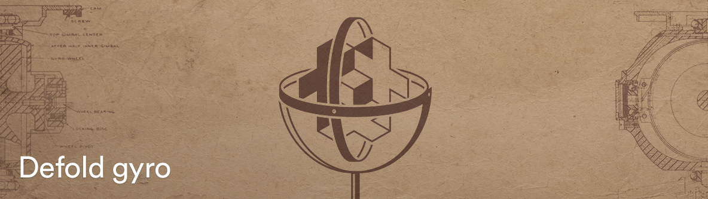

# Gyro
This is a gyroscope extension for the [Defold game engine](http://www.defold.com).

## System requirements
The extension currently only supports iOS and Android.

## Installation
You can use the Gyro extension in your own project by adding this project as a [Defold library dependency](http://www.defold.com/manuals/libraries/). Open your game.project file and in the dependencies field under project add:

https://github.com/britzl/defold-gyro/archive/master.zip

## Usage
    function init(self)
      gyro.start(function(self, quatx, quaty, quatz, quatw)
        go.set_rotation(vmath.quat(quatx, quaty, quatz, quatw))
      end)
    end

    function final(self)
      gyro.stop()
    end

## Example
The project contains an example that leverages [the camera extension](https://github.com/defold/extension-camera) to create an augmented reality experience:

Note: The camera extension currently doesn't support Android which means that the Android example will use a static background instead of the camera feed.
